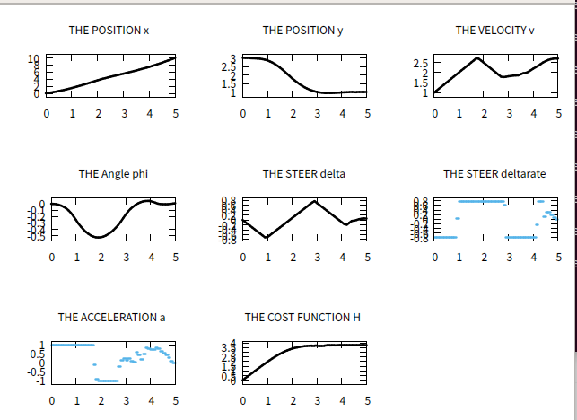

# MPC using ACADO Toolkit

## Project plan

 When I've first heard about MPC, I thought I can use this optimization technique in local planning.
So I tried local planning only giving starting constraints(x=0, y =3 etc) and custom function which makes ego-vehicle to
move to y = 3, but it didn't work. I guess the problem was that when I don't give enough constraints, there are too many
possibilities so that optimization is infeasible.

 So when I gave end point constraints (x=10,y=1) and the custom function, It worked pretty well as the figure below.
My next plan is to use this local planning optimization technique in the simulation. But I'm not sure how to pick an end point yet
 since the position of end point might be wrong choice. So I have to make an algorithm that decides ego-vehicle to keep the lane 
or change it.

